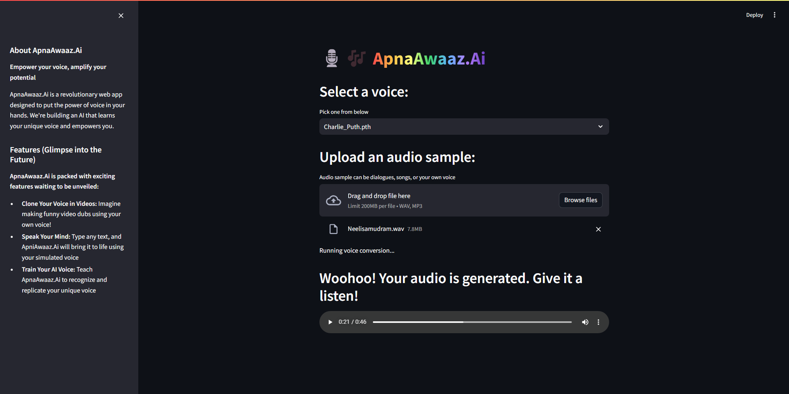

# ApnaAwaaz.Ai

Project for HackPrix hackathon (Sponsored by GitHub, HackQuest, ETHIndia, Polygon, Bobble, Catalog, Tezos).

## Requirements

- Create a conda venv with python verison 3.9:

```sh
python -m venv venv
source venv\bin\activate
pip install rvc-python
pip install torch==2.1.1+cu118 torchaudio==2.1.1+cu118 --index-url https://download.pytorch.org/whl/cu118
```

- To run the app, just type:

```sh
streamlit run stream-ui.py
```

- Install RVC-beta from [https://huggingface.co/lj1995/VoiceConversionWebUI/tree/main here]

# Features

## AI Model

- The AI model leverages TensorFlow for training and generating high-quality voice synthesis. It uses advanced NLP techniques for understanding context and generating appropriate audio responses.

## Convert Any Audio Clip

- Using RVC (Retrieval-based Voice Conversion), this feature allows users to transform any audio clip—be it a song, a famous movie dialogue, or a joke—into their own voice. The AI analyzes the audio's pitch, tone, and tempo, and applies the user's voice profile to create a personalized version.

## Text to Speech

- This feature uses Text-to-Speech (TTS) technology to convert any text input into speech using the user's cloned voice. It's perfect for sending quick voice messages in chats without recording new audio each time.

## Generate New Songs

- By integrating generative AI tools, ApnaAawaz.ai can create new songs based on user-provided lyrics or themes. The generated music is then synthesized in the user's voice, providing a unique and personalized musical experience.

## Make Chat Conversations More Fun

- ChatFunAI enhances chat interactions by allowing users to send personalized audio clips. Whether it's singing a song to make up after a fight, quoting a famous movie line, or sharing a joke, the application makes conversations more lively and engaging.

## Contributing

- We welcome contributions to improve ApnaAwaaz.ai. To contribute, please fork the repository, create a new branch, and submit a pull request with your changes. Ensure that your code adheres to the project's coding standards and includes appropriate tests.

- Fork the repository
- Create a new branch (git checkout -b feature/your-feature-name)
- Make your changes
- Commit your changes (git commit -m 'Add some feature')
- Push to the branch (git push origin feature/your-feature-name)
- Open a pull request


